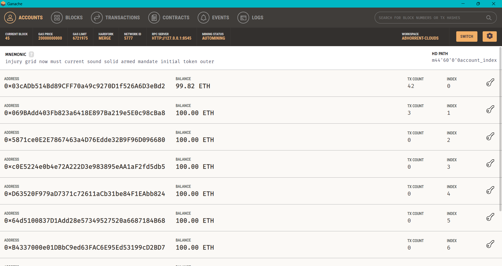
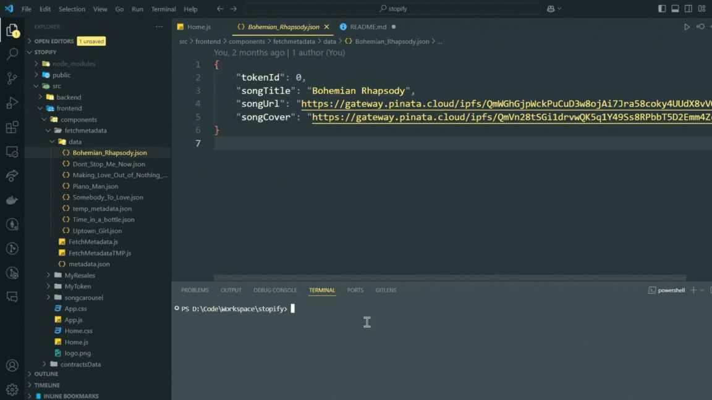
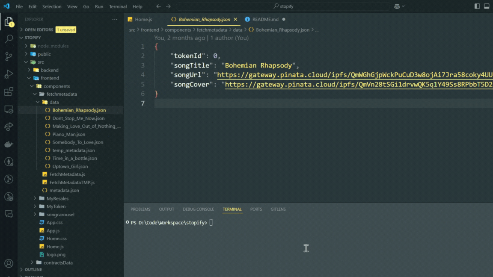
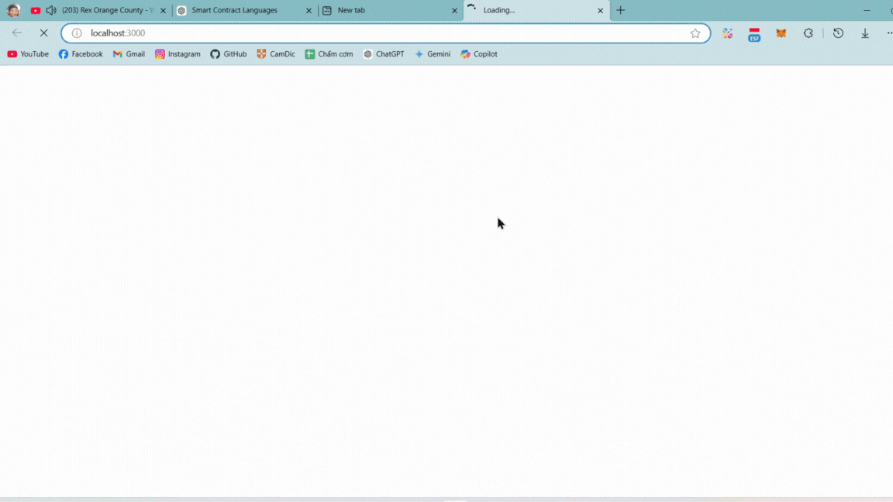
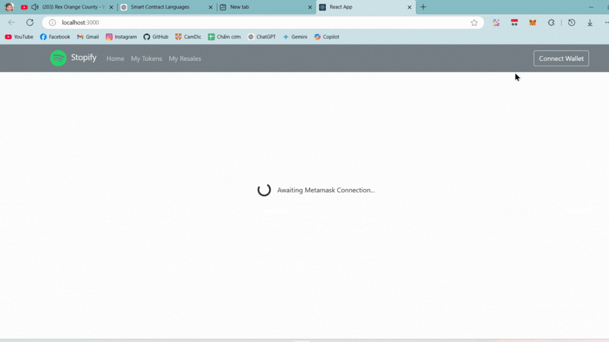
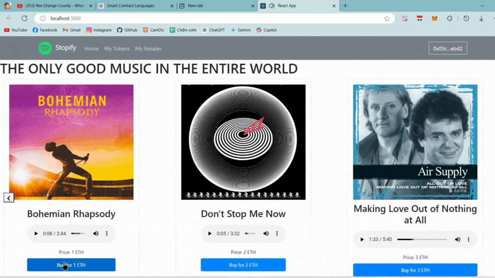
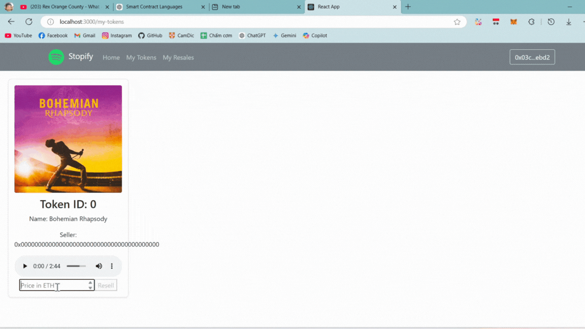

# 🎵 Stopify – NFT Music Marketplace

#### Just a small app for a blockchain's project. A music player web app built with Javascript, using Blockchain to store and manage data.

## 🚀 Getting Started

### 1. Start Ganache (local blockchain)



> Ganache running

### 2. Deploy contract

```bash
npm run deploy
```



Start Web App: `npm run start`


Stopify


Connect Wallet


Buy NFT


Purchased NFT


Resell NFT

